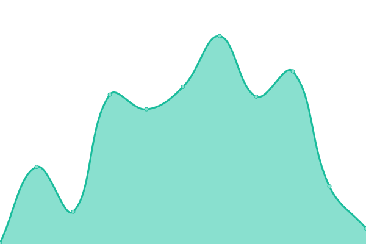

# [📈 Live Status](https://demo.upptime.js.org): <!--live status--> **🟩 All systems operational**

This repository contains the open-source uptime monitor and status page for [9ooooooooomin](https://9min.github.io/upptime), powered by [Upptime](https://github.com/upptime/upptime).

With [Upptime](https://upptime.js.org), you can get your own unlimited and free uptime monitor and status page, powered entirely by a GitHub repository. We use [Issues](https://github.com/9min/upptime/issues) as incident reports, [Actions](https://github.com/9min/upptime/actions) as uptime monitors, and [Pages](https://demo.upptime.js.org) for the status page.

<!--start: status pages-->
<!-- This summary is generated by Upptime (https://github.com/upptime/upptime) -->
<!-- Do not edit this manually, your changes will be overwritten -->

| URL                                                                           | Status | History                                                                                                               | Response Time                                                                                 | Uptime                                                                                                                                                                                                                                       |
| ----------------------------------------------------------------------------- | ------ | --------------------------------------------------------------------------------------------------------------------- | --------------------------------------------------------------------------------------------- | -------------------------------------------------------------------------------------------------------------------------------------------------------------------------------------------------------------------------------------------- |
| [9min-wedding-invitation](https://9min.github.io/wedding-invitation/)         | 🟩 Up  | [9min-wedding-invitation.yml](https://github.com/9min/upptime/commits/master/history/9min-wedding-invitation.yml)     |  121ms  |      |
| [joohee-wedding-invitation](https://joohee0928.github.io/wedding-invitation/) | 🟩 Up  | [joohee-wedding-invitation.yml](https://github.com/9min/upptime/commits/master/history/joohee-wedding-invitation.yml) |  99ms |  |
| Secret Site                                                                   | 🟩 Up  | [secret-site.yml](https://github.com/9min/upptime/commits/master/history/secret-site.yml)                             |  683ms              |                              |

<!--end: status pages-->

[**Visit our status website →**](https://9min.github.io/upptime)

## 📄 License

- Code: [MIT](./LICENSE) © [9ooooooooomin](https://9min.github.io/upptime)
- Data in the `./history` directory: [Open Database License](https://opendatacommons.org/licenses/odbl/1-0/)
