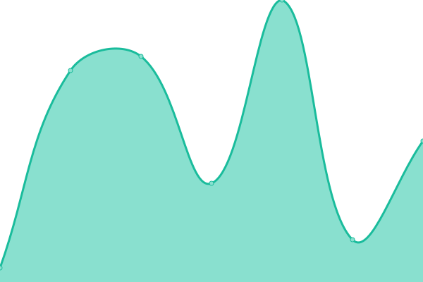
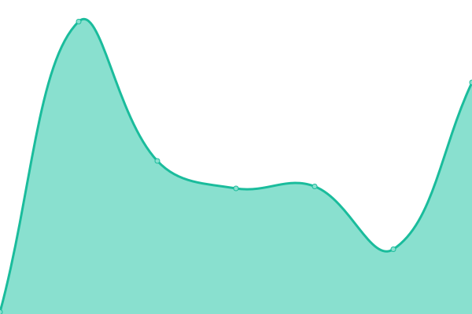

# [📈 Live Status](https://demo.upptime.js.org): <!--live status--> **🟧 Partial outage**

This repository contains the open-source uptime monitor and status page for [9ooooooooomin](https://9min.github.io/upptime), powered by [Upptime](https://github.com/upptime/upptime).

With [Upptime](https://upptime.js.org), you can get your own unlimited and free uptime monitor and status page, powered entirely by a GitHub repository. We use [Issues](https://github.com/9min/upptime/issues) as incident reports, [Actions](https://github.com/9min/upptime/actions) as uptime monitors, and [Pages](https://demo.upptime.js.org) for the status page.

<!--start: status pages-->
<!-- This summary is generated by Upptime (https://github.com/upptime/upptime) -->
<!-- Do not edit this manually, your changes will be overwritten -->
<!-- prettier-ignore -->
| URL | Status | History | Response Time | Uptime |
| --- | ------ | ------- | ------------- | ------ |
|  [stock-streaming-viewer](https://9min.github.io/stock-streaming-viewer/) | 🟩 Up | [stock-streaming-viewer.yml](https://github.com/9min/upptime/commits/HEAD/history/stock-streaming-viewer.yml) | 

 119ms
     
 | 

<a href="https://9min.github.io/upptime/history/stock-streaming-viewer">100.00%</a>
    

|  [9min-wedding-invitation](https://9min.github.io/wedding-invitation/) | 🟥 Down | [9min-wedding-invitation.yml](https://github.com/9min/upptime/commits/HEAD/history/9min-wedding-invitation.yml) | 

 21ms
     
 | 

<a href="https://9min.github.io/upptime/history/9min-wedding-invitation">100.00%</a>
    

|  [joohee-wedding-invitation](https://joohee0928.github.io/wedding-invitation/) | 🟥 Down | [joohee-wedding-invitation.yml](https://github.com/9min/upptime/commits/HEAD/history/joohee-wedding-invitation.yml) | 

 70ms
     
 | 

<a href="https://9min.github.io/upptime/history/joohee-wedding-invitation">100.00%</a>
    

|  Secret Site | 🟩 Up | [secret-site.yml](https://github.com/9min/upptime/commits/HEAD/history/secret-site.yml) | 

 636ms
     
 | 

<a href="https://9min.github.io/upptime/history/secret-site">100.00%</a>
    

<!--end: status pages-->

[**Visit our status website →**](https://9min.github.io/upptime)

## 📄 License

- Code: [MIT](./LICENSE) © [9ooooooooomin](https://9min.github.io/upptime)
- Data in the `./history` directory: [Open Database License](https://opendatacommons.org/licenses/odbl/1-0/)
